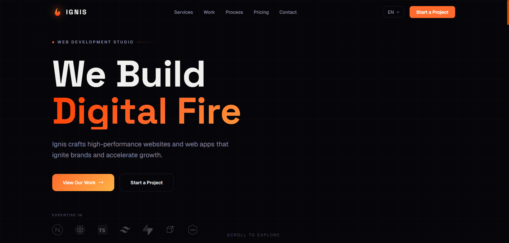
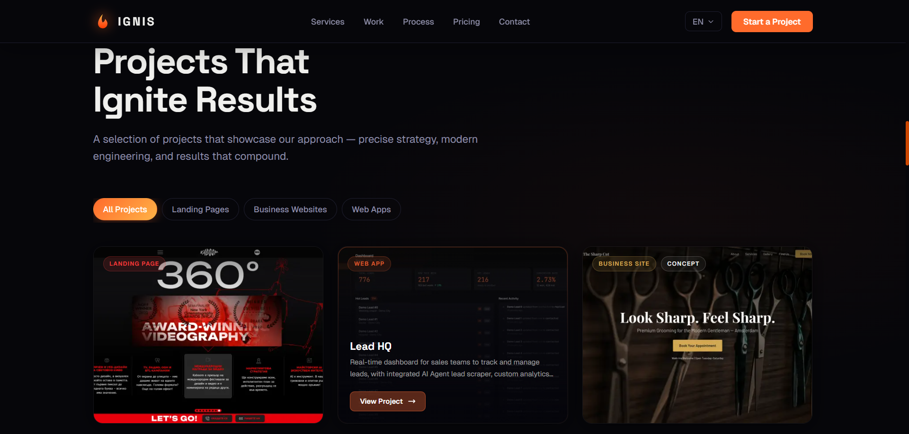

# Ignis Web Studio

Marketing site for **Ignis** — a web development studio building fast, conversion-focused websites and web apps for small and mid-sized businesses across English- and German-speaking Europe. Fully trilingual (EN / DE / BG), statically rendered, and animation-driven.

**Live demo:** https://www.ignis-mls.com


## What it is

This is the studio's own portfolio and lead-generation site. The problem it solves is straightforward: present a small agency's services, pricing, process, and case studies in a way that converts visitors into booked calls — without sacrificing performance or polish.

The approach is a Next.js 16 App Router site rendered statically per locale, with each section lazy-loaded and animated on scroll via GSAP. Content lives in per-locale message files, and the contact form proxies to Formspree through a server route so no provider keys ever touch the client.

## Screenshots




## Features

- **Trilingual i18n** — English, German, and Bulgarian, each statically generated under its own locale segment with locale-aware routing.
- **Scroll-driven animations** — GSAP + ScrollTrigger entrance animations throughout, plus `vanilla-tilt` card micro-interactions.
- **Filterable work showcase** — project cards with category filter tabs and a case-study modal (challenge / solution / stack / gallery).
- **Contact form via server route** — `POST /api/contact` validates and forwards submissions to Formspree, keeping the endpoint server-side.
- **Calendly booking** — CTA buttons open a configurable Calendly link.
- **Dynamic OG images** — generated at the edge via `/api/og`.
- **SEO built in** — per-locale metadata, canonical + hreflang alternates, JSON-LD structured data, `robots.ts`, `sitemap.ts`, and `llms.txt`.
- **Legal pages** — privacy policy, terms of service, cookie policy, and imprint, driven from typed content files.

## Tech stack

| Layer | Technology |
|---|---|
| Framework | Next.js 16 (App Router, Turbopack) |
| Language | TypeScript 5 |
| UI | React 19 |
| Styling | Tailwind CSS v4 (CSS-first config) + `@tailwindcss/typography` |
| i18n | next-intl 4 |
| Animation | GSAP 3 + ScrollTrigger, vanilla-tilt |
| Content | react-markdown + remark-gfm |
| Tooling | ESLint 9, `@next/bundle-analyzer` |
| Hosting | Vercel (inferred from deployment domain / OG edge route) |

## Run locally

```bash
npm install
npm run dev      # dev server at http://localhost:3000
npm run build    # production build — primary correctness check (TS + SSG)
npm run start    # serve the production build
npm run lint     # ESLint
```

There are no tests; `npm run build` is the main correctness gate.

### Environment variables

Copy `.env.example` to `.env.local` and fill in your own values (names only below — no secrets are committed):

| Variable | Used by | Notes |
|---|---|---|
| `FORMSPREE_URL` | `/api/contact` | Server-side only. Without it the contact route returns a 500. |
| `NEXT_PUBLIC_CALENDLY_URL` | Contact CTA / project modal | Public; exposed to the client by design. |
| `ANALYZE` | build | Optional. Set to `true` to run the bundle analyzer. |

## Notes

- **Next.js 16 conventions.** Route `params` are Promises and must be awaited; request interception lives in `src/proxy.ts` (not the deprecated `middleware.ts`). The root `app/layout.tsx` is a pass-through — the real `<html>`/`<body>` sit in `app/[locale]/layout.tsx`.
- **Tailwind v4 has no config file.** All design tokens (the dark/fire palette, fonts) are declared in `globals.css` under `@theme`.
- **Locale as the single source of truth.** `src/i18n/routing.ts` defines the locale list; `generateStaticParams` fans every route out across `en` / `bg` / `de` at build time, and `setRequestLocale` is called before any other next-intl access.
- **Sections are lazy-loaded.** The homepage renders `Hero` eagerly and dynamically imports the rest behind skeletons, so below-the-fold animation code is only fetched when needed.
- **Contact stays keyless on the client.** The form hits an internal API route that holds the Formspree URL, so the provider endpoint is never shipped to the browser.

---

Part of my portfolio — https://portfolio-mihail.vercel.app/
Mihail Kirkov · mihailkirkov04@gmail.com
